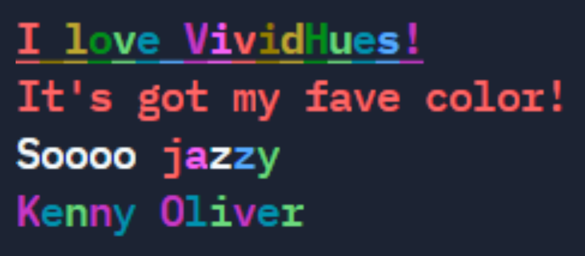

# VividHues :rainbow: :package:

[](https://github.com/KennyOliver/VividHues/actions/workflows/python-publish.yml)


**VividHues: super lite package for colored strings in Python!**

<a href="https://pypi.org/project/VividHues/"></a>
<a href="https://test.pypi.org/project/VividHues/"></a>



---

## :hammer_and_wrench: Official Installation
##### Pop this command in your terminal to install VividHues.
```bash
pip install VividHues
```

### :bricks: Dependency
#### _`requirements.txt`_ (Highly Recommended!)
###### Append the following to your Python packages `requirements.txt`.
```python
VividHues>=5.2.0
```
###### Changelog:
```python
VividHues==3.0.0  # only has Clr codes
VividHues>=4.1.0  # adds: abbreviations & Magic Functions
VividHues>=5.2.0  # adds: Clr.pattern()
```

#### _`.github/Dependabot.yml`_ (optional, but needs requirements.txt)
###### First, if you don't already have a `.github` directory: create one.
###### Then, add a `Dependabot.yml` file to it.
```yaml
version: 2
updates:
  - package-ecosystem: "pip"
    directory: "/"
    schedule:
      interval: "daily"
```

#### _`Dockerfile`_ :whale: (optional)
###### You can use this if you have a Docker container.
```dockerfile
# recommended
COPY requirements.txt .
RUN pip install -r requirements.txt
```
```dockerfile
# alternatively...
RUN pip install VividHues
```

---

## :snake: Python Example


```python
print(Clr.BO + Clr.UL + Clr.rainbow('I love VividHues!') + Clr.RS)
print(f"{Clr.RED}It's got my fave color!{Clr.RS}")
print(f"Soooo {Clr.jazzy('jazzy') + Clr.RS}")
#                          ^^^
# you'll get an error using "" in f-string interpolations
print(Clr.pattern("Kenny Oliver", Clr.PURPLE, Clr.CYAN, Clr.LIME) + Clr.RS)
```

## :rainbow: Available Clr codes:
#### Just put a code in the gap ```Clr.___```

###### Clr: &nbsp;&nbsp;&nbsp;&nbsp;&nbsp;&nbsp;&nbsp;&nbsp;&nbsp;&nbsp;&nbsp;&nbsp;&nbsp;&nbsp; RED, ORANGE, YELLOW, LIME, GREEN, BLUE, CYAN, PURPLE, PINK, BLACK, WHITE
###### Formatter: &nbsp;&nbsp; UNDERLINE, UL, BOLD, BO, RESET, RS


### :magic_wand: Magic Functions

#### :game_die: Clr.random()
```python
print(Clr.random(string))
```
###### Paints your string in a random Clr code.

#### :saxophone: Clr.jazzy()
```python
print(Clr.jazzy(string))
```
###### Paints each letter in jazzy random colors! It's a total gamble, that's guaranteed to be ugly! :)

#### :rainbow: Clr.rainbow()
```python
print(Clr.rainbow(string))
```
###### Paints your string in a rainbow pattern.

#### :test_tube: Clr.pattern()
```python
print(Clr.pattern(string, *color))
```
###### Paint your letters in a repeating pattern, by specifying an unlimited amount of Clr codes!

---

## :muscle: How VividHues stacks up...
| Feature | [VividHues](https://pypi.org/project/VividHues/) | [Colorama](https://pypi.org/project/colorama/) | [termcolor](https://pypi.org/project/termcolor/) |
| :-----: | :-------: | :------: | :-------: |
| Simplicity/Abstraction | :star: | :star: | :star: |
| Font Colors | :star: | :star: | :star: |
| Background/Highlight | :crossed_fingers: | :star: | :star: |
| Bold/Underline | :star: |  | :star: |
| Lightweight | :star: |  |  |
| Auto-Reset | :crossed_fingers: | :star: |  |
| Cursor-Positioning |  | :star: |  |
| Special Features | :star: |  | :star: |
| <b>Total</b> | <b>5/8 + 2/8 = 7/8</b> | <b>5/8</b> | <b>5/8</b> |

Potentially, VividHues will have more features than the competition if they are implemented.

---
Kenny Oliver ©2021
