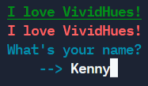

# VividHues :rainbow: :paintbrush: :package:

[](https://github.com/KennyOliver/VividHues/actions/workflows/publish_to_test_pypi.yml)


<!-- [](https://repl.it/@KennyOliver/vividHues) -->

**VividHues is a lightweight Python package for coloured strings in the Python console!**
Check it out on PyPi

## Official Installation
```python
from VividHues import Clr
```

## :toolbox: How to use VividHues



```python
# Recommended Method
print(f"{Clr.BOLD + Clr.UNDERLINE + Clr.GREEN}I love VividHues!{Clr.RESET}")
any_string = f"{Clr.BOLD + Clr.CYAN}Hello {Clr.GREEN}earthlings!{Clr.RESET}"


# Alternatives
print(Clr.RED + "I love VividHues!" + Clr.RESET)
name = input(Clr.CYAN + "What's your name?\n\t--> " + Clr.RESET)
# For input() use plusses, not commas!
```

<details><summary>:rainbow: Available colours:</summary>

#### _COLOURS_
* RED
* ORANGE
* YELLOW
* LIME
* GREEN
* BLUE
* CYAN
* PURPLE
* PINK
* BLACK
* WHITE

#### _FORMATTING_
* UNDERLINE
* BOLD
* RESET

</details>

---
Kenny Oliver ©2021
