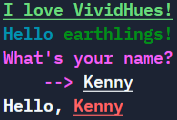

# VividHues :rainbow: :paintbrush: :package:

[](https://github.com/KennyOliver/VividHues/actions/workflows/publish_to_test_pypi.yml)


<!-- [](https://repl.it/@KennyOliver/vividHues) -->

**VividHues: super lightweight package for coloured strings in Python!**

<a href="https://pypi.org/project/VividHues/"></a>

## :hammer_and_wrench: Official Installation
Use this command to install VividHues.
```bash
pip install VividHues
```

### :bricks: Dependency
_requirements.txt_
```
VividHues>=2.7.9
```

_Dependabot.yml_
```yaml
version: 2
updates:
  - package-ecosystem: "pip"
    directory: "/"
    schedule:
      interval: "daily"
```

_Dockerfile_
```dockerfile
RUN pip install VividHues

# or

COPY requirements.txt .
RUN pip install -r requirements.txt
```


## :toolbox: Python Example



```python
from VividHues import Clr


# f-strings - recommended
print(f"{Clr.BO + Clr.UNDERLINE + Clr.LIME}I love VividHues!{Clr.RS}")
any_string = f"{Clr.BO + Clr.CYAN}Hello {Clr.GREEN}earthlings!{Clr.RS}"
print(any_string)


# alternatives
name = input(Clr.PINK + "What's your name?\n\t--> " + Clr.RS + Clr.UL)
print(Clr.RS + Clr.BO + "Hello,", Clr.RED + Clr.UL + name)
```

## :rainbow: Available colours:

| Colour Codes | Formatting Codes | Formatting Code Abbreviations |
| :----------: | :--------------: | :---------------------------: |
| Clr.RED      | Clr.UNDERLINE    | Clr.UL |
| Clr.ORANGE   | Clr.BOLD         | Clr.BO |
| Clr.YELLOW   | Clr.RESET        | Clr.RS |
| Clr.LIME     |                  |
| Clr.GREEN    |                  |
| Clr.BLUE     |                  |
| Clr.CYAN     |                  |
| Clr.PURPLE   |                  |
| Clr.PINK     |                  |
| Clr.BLACK    |                  |
| Clr.WHITE    |                  |

---
Kenny Oliver ©2021
